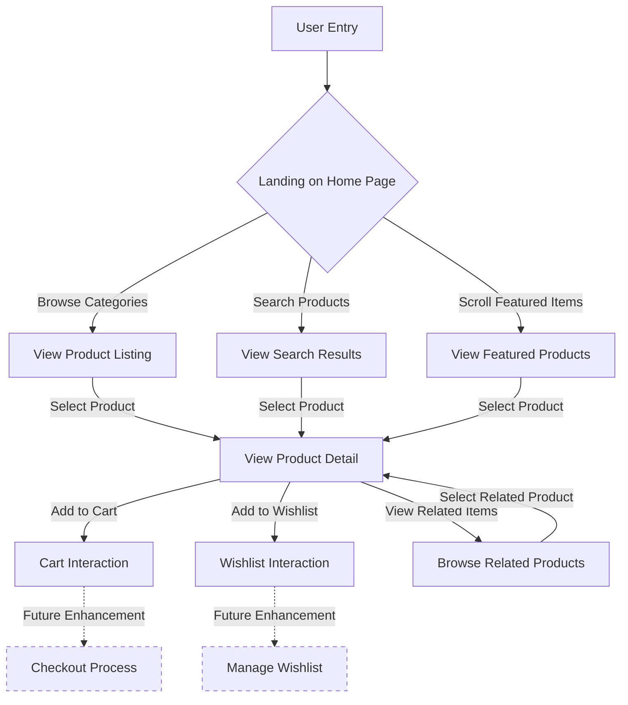
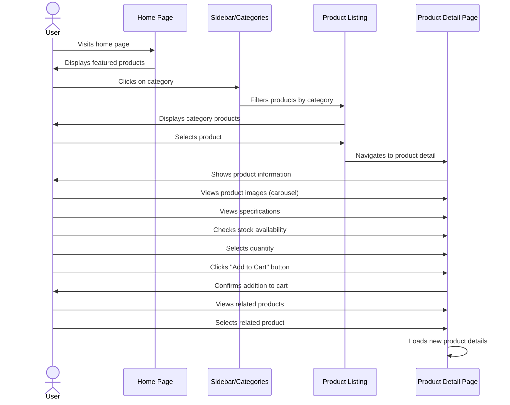
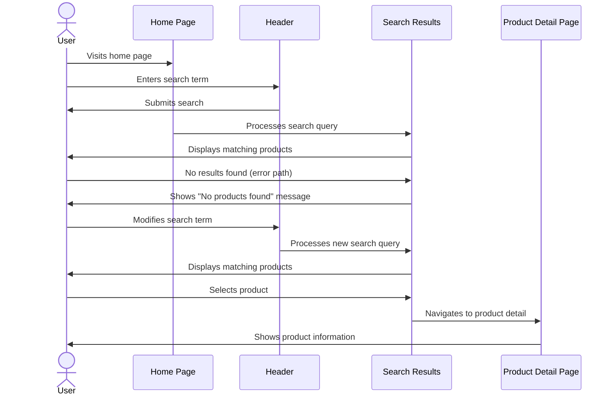
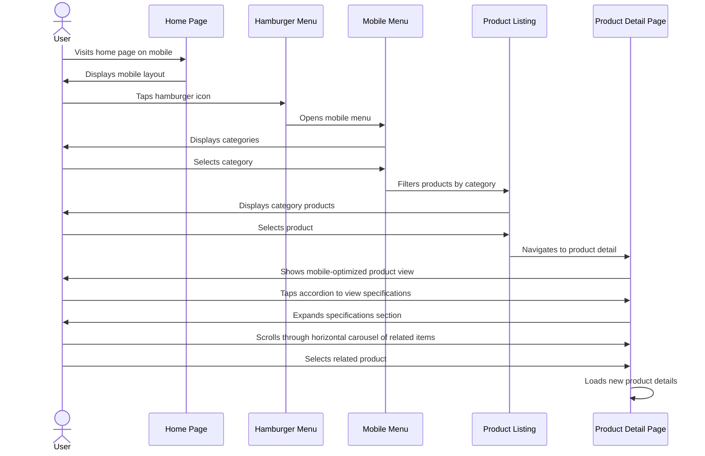
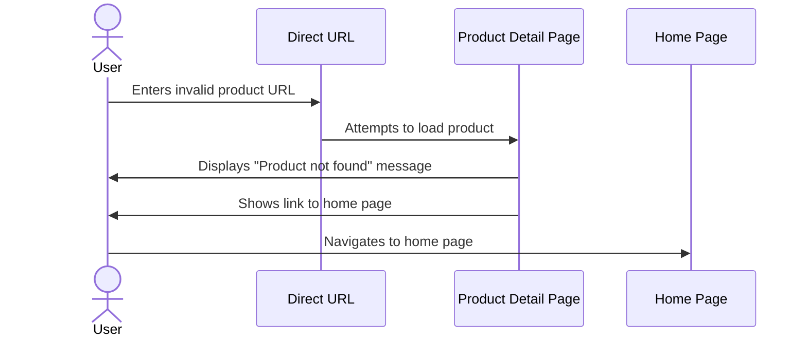
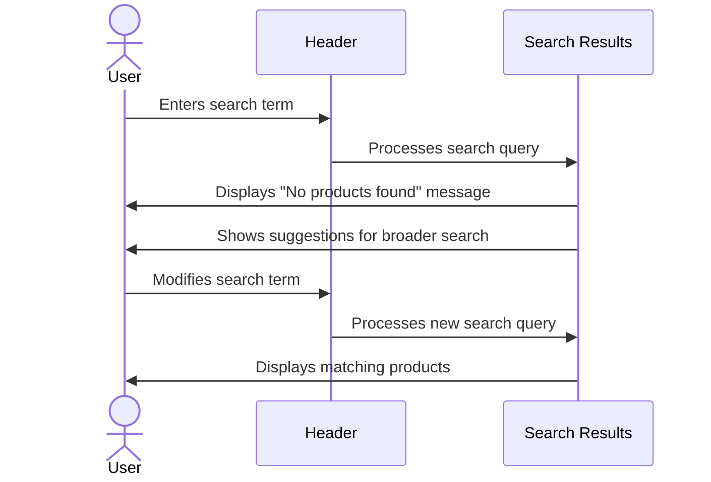
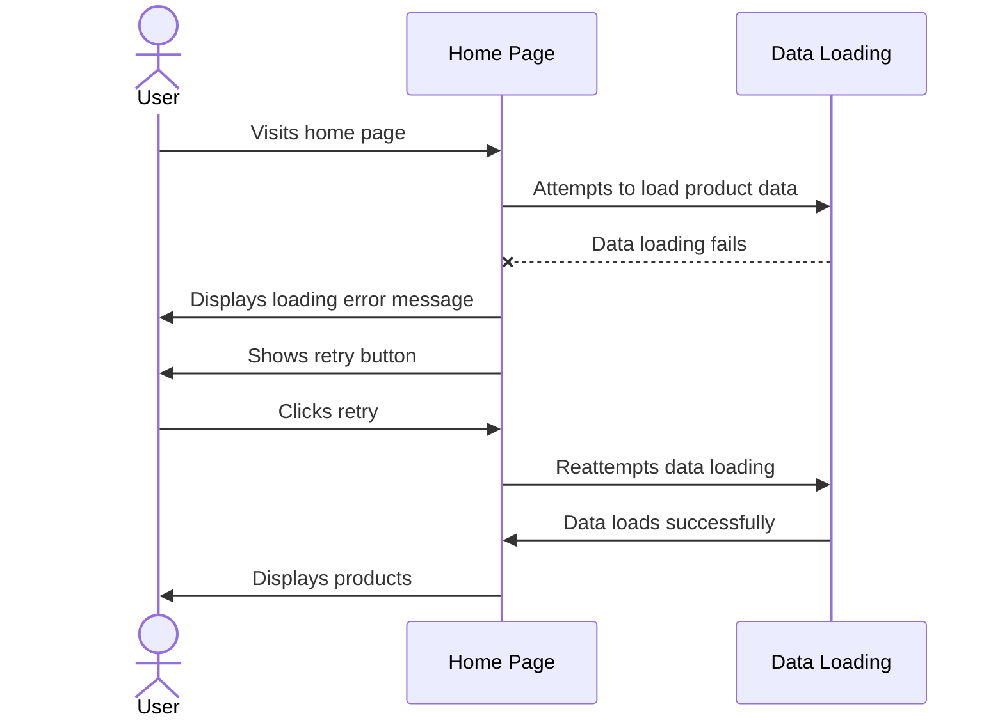

# E-Commerce Frontend Application Flow

## Overview

This document outlines the user flow and interaction patterns for the e-commerce frontend application displaying electronic products. The flows prioritize MVP features that can be implemented within the one-hour build constraint timeframe.

## User Journey Map

### Entry Points
- Direct URL to home page
- Direct URL to product detail page
- Category selection from search engine results

### Critical Paths
1. Home → Category Navigation → Product Selection → Product Detail
2. Home → Search → Search Results → Product Detail
3. Product Detail → Related Products → New Product Detail

### Exit Points
- Close browser/tab
- Navigate away from site
- Session timeout (N/A for PoC)

## Core Interaction Flows (MVP Features)

### Flow 1: Browse and View Product Detail

### Flow 2: Search for Products

### Flow 3: Mobile Navigation Experience

## Error Handling Flows

### Product Not Found Flow

### Search With No Results Flow

### Network/Loading Error Flow

## Detailed Example Flow: Product Browsing and Detail View

### Happy Path

1. User lands on the home page
2. User sees featured products in a grid layout
3. User clicks on the "Computers" category in the sidebar
4. The product listing updates to show only computer products
5. User clicks on "MacBook Pro 16-inch" product card
6. System navigates to the product detail page
7. User sees product images in a vertical carousel
8. User scrolls down to view the full product description
9. User views product specifications
10. User checks that the item is in stock (15 units available)
11. User sets quantity to 2 using the quantity selector
12. User clicks "Add to Cart" button
13. System shows confirmation that the product was added to cart
14. User scrolls down to see related products
15. User clicks on a related product
16. System loads the new product detail page

### Error Scenario: Product Out of Stock

1. User lands on the home page
2. User searches for "Latest Gaming Laptop"
3. User clicks on a search result
4. System navigates to the product detail page
5. User sees that the product is out of stock (0 units available)
6. The "Add to Cart" button is disabled
7. System displays a message suggesting to check back later
8. User cannot proceed with adding the item to cart
9. User can still view product details and related products
10. User clicks on an in-stock related product
11. System loads the new product detail page with an available product

## Success Metrics

### Key Performance Indicators (MVP)

| Metric | Description | Target |
|--------|-------------|--------|
| Product View Rate | Percentage of users who view product details after landing on home | >30% |
| Category Navigation Rate | Percentage of users who use category navigation | >50% |
| Search Usage | Percentage of users who use search functionality | >20% |
| Related Product Clicks | Percentage of product detail views that lead to related product clicks | >15% |
| Mobile Usability | Successful task completion rate on mobile devices | >90% |

### Technical Performance Metrics

| Metric | Target |
|--------|--------|
| Initial Page Load Time | <2 seconds |
| Time to Interactive | <3 seconds |
| Product Detail Page Load | <1.5 seconds |
| Search Response Time | <1 second |

## Constraints and Limitations

- This flow documentation focuses only on the MVP features as specified
- Full cart functionality and checkout process are excluded (future enhancement)
- User authentication and account management are not included in MVP
- All interactions are client-side only with no backend integration
- Product data is static and loaded from JSON files
